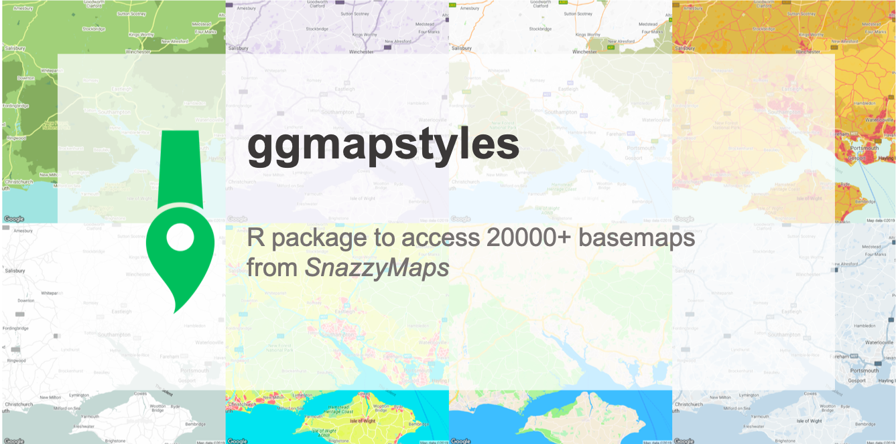

<!-- README.md is generated from README.Rmd. Please edit that file -->


```{r, echo=FALSE, message=FALSE, warning=FALSE}
knitr::opts_chunk$set(
                      collapse = TRUE,
                      comment = "#>",
                      fig.path = "man/figures/README-",
                      echo = FALSE,
                      fig.align = "center",
                      out.width = "100%"
)

library(ggmap)
library(ggmapstyles)
library(tidyverse)
library(rvest)

options(scipen = 999)
```

# ggmapstyles 

[](https://travis-ci.org/mikey-harper/ggmapstyles)
[](https://ci.appveyor.com/project/mikey-harper/ggmapstyles)
[](http://www.repostatus.org/#active)

*****

```{r, out.width="100%", fig.width=4}

```


## Overview

**ggmapstyles** is an R package which extends the [ggmap](https://github.com/dkahle/ggmap) package. This package simplifes the process of creating custom designs for Google Maps, and provides a range of tools for quickly loading themes from [Snazzy Maps](https://snazzymaps.com/) by simply copying a website URL.

```{r CountNumStyles, warning=FALSE}
# Counts how many styles have been released
countStyles <- 
  xml2::read_html("https://snazzymaps.com/press") %>%
  html_nodes(xpath = '//*[@class="figure-stat-value"]') %>%
  .[2] %>%
  str_replace('<div class="figure-stat-value">', "") %>%
  str_replace('\n</div>', "") %>%
  str_replace(",", "") %>%
  as.numeric()

# Find the nearest thousand of the value
countStyles <- (floor(countStyles/1000)*1000)
```

Say goodbye to the standard Google Maps background, and easily choose from one of over `r countStyles` custom themes! If you cannot find a style you like, it is easy to sign up and create your own customised layers.

> This package is still in development. If you find any errors, or have any suggestions for improvements, please open an [Issue](https://github.com/mikey-harper/ggmapstyles/issues).

A selection of some of the styles available are shown below:

```{r maps, fig.height=8, fig.width=8, echo = FALSE, message = FALSE, warning = FALSE, fig.align="center", cache = TRUE}
# List maps to include
urls <- c("https://snazzymaps.com/style/35/avocado-world",
          "https://snazzymaps.com/style/98/purple-rain",
          "https://snazzymaps.com/style/84/pastel-tones",
          "https://snazzymaps.com/style/64/old-dry-mud",
          "https://snazzymaps.com/style/8097/wy",
          "https://snazzymaps.com/style/23/bates-green",
          "https://snazzymaps.com/style/127403/no-label-bright-colors",
          "https://snazzymaps.com/style/83/muted-blue",
          "https://snazzymaps.com/style/127403/no-label-bright-colors",
          "https://snazzymaps.com/style/14/vintage",
          "https://snazzymaps.com/style/68/aqua",
          "https://snazzymaps.com/style/126378/vintage-old-golden-brown",
          "https://snazzymaps.com/style/72/transport-for-london",
          "https://snazzymaps.com/style/6296/darkdetail",
          "https://snazzymaps.com/style/21/hopper",
          "https://snazzymaps.com/style/40/vitamin-c")

# Create Plot
plotGrid <-
  lapply(urls, function(x)
ggmap(get_snazzymap(center = "Southampton, UK", mapRef = x, maptype = "roadmap")) +
  annotate(geom = "label", x = -0.97, y = 50.64, 
           label = paste0("Style ID: ", basename(dirname(x))), 
           hjust = 1, vjust = 0, label.r = unit(0, "lines"), label.size = 0) +
  theme_void() +
  theme(plot.title = element_text(hjust = 0.5, margin = margin(0.5, 0, 0.5, 0, unit = "cm") ))
)

# Plot the results
gridExtra::grid.arrange(grobs = plotGrid, ncol = 4)

```

## Installation

You can install the development version of the package through Github:

```
devtools::install_github("dr-harper/ggmapstyles")
```

Google recently changed their API requirements, so you will need to register with Google first. A useful guide is found in the **ggmaps** package: https://github.com/dkahle/ggmap

## Usage

You can browse [Snazzy Maps](https://snazzymaps.com/) to find a style you like. A number of functions have been developed to simplify the usage of Snazzymaps within existing workflows.

The main function to use within the package is `get_snazzymap`. This is a wrapper of the `get_googlemap` function, with the style of the map being set by `mapRef`:

```{r exampleMap, message = FALSE, echo = TRUE}
library(ggmapstyles)
basemap <- get_snazzymap("Southampton, UK", mapRef = "https://snazzymaps.com/style/83/muted-blue")
ggmap(basemap)
```

The `mapRef` parameter can accept the Snazzy Map reference in a number of different ways:

- Full URL: `mapRef = "https://snazzymaps.com/style/83/muted-blue"`
- ID & Name: `mapRef = "83/muted-blue"`
- ID: `mapRef = 83`

You can also supply additional arguments to the `get_snazzymap` function which are provided to `get_googlemap`. For example, the zoom can be changed as follows:

```{r themeTwo, message = FALSE, echo = TRUE, cache = TRUE}
basemap <- get_snazzymap("Southampton, UK", mapRef = "98/purple-rain", zoom = 15)
ggmap(basemap)
```

It's useful to note that the `maptype` argument of `get_googlemap` still defaults to returning a terrain map. This may make the Snazzymaps styling look different from expected, and different from the appearance on the Snazzymaps site, where the default is a roadmap. This is mostly useful for styling terrain or roadmaps; some, but not all, styling will show up with hybrid maps as well.

```{r maptype, message=FALSE, echo=TRUE, cache=TRUE, fig.height=3.3, fig.width=10}
# default: terrain
terrain <- ggmap(get_snazzymap("Southampton, UK", mapRef = "23/bates-green")) +
  ggtitle("Terrain")
roadmap <- ggmap(get_snazzymap("Southampton, UK", mapRef = "23/bates-green", maptype = "roadmap")) +
  ggtitle("Roadmap")
hybrid <- ggmap(get_snazzymap("Southampton, UK", mapRef = "23/bates-green", maptype = "hybrid")) +
  ggtitle("Hybrid")

gridExtra::grid.arrange(terrain, roadmap, hybrid, ncol = 3)
```


If you would rather use the `style` argument within the `get_googlemap`, you can create a formatted string using the `ggmap_style_sm` function:

```{r extractStyleString, message = FALSE, echo = TRUE}
style_string <- ggmap_style_sm("84/pastel-tones")
style_string
```

This string can then easily be reused within any other ggmap function which takes a style argument. This approach is recommended if you want to plot multiple maps with the same basemap:

```{r StyleStringMultiple, echo=TRUE, fig.height=3.3, fig.width=10, message=FALSE, cache = TRUE}
plot1 <- ggmap(get_googlemap("Southampton, UK", style = style_string)) + labs(title = "Southampton")
plot2 <- ggmap(get_googlemap("London, UK", style = style_string)) + labs(title = "London")
plot3 <- ggmap(get_googlemap("Bristol, UK", style = style_string)) + labs(title = "Bristol")

gridExtra::grid.arrange(plot1, plot2, plot3, ncol = 3)
```

## Cached Styles

16 map styles are supplied within the package. These can be accessed by using the `map_styles()` function, and the following styles are available:

```{r tableOfStyles}
knitr::kable(ggmapstyles::list_styles())
```

There are several ways you can use this function to refer to a style:

- By name: `map_style("Blue Essence")`
- By ID: `map_style(ID = "40")`
- Pick one style at random: `map_style(random = TRUE)`: this also prints a message so that you know which style to reuse.

```{r mapStyles, echo = TRUE}
# search by name
map_style("Blue Essence")

# search by ID
map_style(ID = "40")

# Use directly within ggmap function
ggmap::get_googlemap("Southampton", style = map_style("apple-like"))
```

## Additional Reading

[This cheatsheet](https://www.nceas.ucsb.edu/~frazier/RSpatialGuides/ggmap/ggmapCheatsheet.pdf) into ggmap is useful for picking up some of the basics of ggmap.


