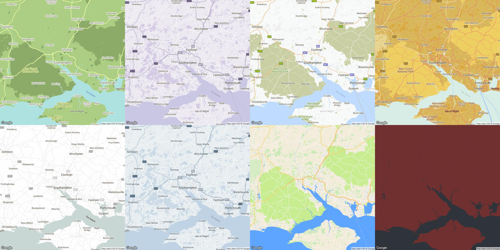

# ggmapstyles

[](https://travis-ci.org/mikey-harper/ggmapstyles)
[](https://ci.appveyor.com/project/mikey-harper/ggmapstyles)

*****

**ggmapstyles** is an R package which extends the excellent [ggmap](https://github.com/dkahle/ggmap) package. This package simplifes the process of creating custom designs for Google Maps, and provides a range of tools for quickly loading themes from [Snazzy Maps](https://snazzymaps.com/) into R.

Say goodbye to the standard Google Maps background, and easily choose from one of over 16,000 custom themes!

]


## Installation

```
devtools::install_github("mikey-harper/ggmapstyles")
```

## Motivation

I really love the ggmap pacakge, and it is a great tool for mapping within ggplot.


## Usage


